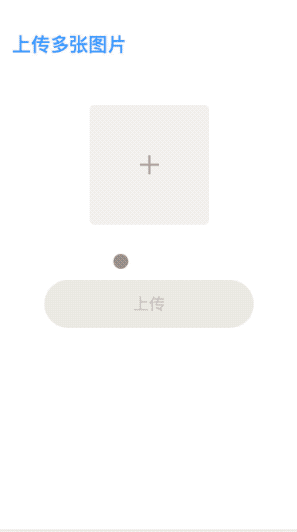

# vue-slim-cropper

[English](./README.md) | 简体中文

## 🌰 示例




[Demo](https://wannaxiao.github.io/vue-slim-cropper/demo/dist/)

[Demo 源码](https://github.com/wannaxiao/vue-slim-cropper/blob/master/demo/App.vue)

## 🚀 快速开始

1.  安装

```bash
yarn add vue-slim-cropper # 或 npm i -S vue-slim-cropper
```

2.  引入

```js
// main.js 入口中
import SlimCropper from 'vue-slim-cropper'
Vue.use(SlimCropper)
```

3.  使用，请参考[Demo 源码](https://github.com/wannaxiao/vue-slim-cropper/blob/master/demo/App.vue)

```html
<SlimCropper ref="cropper" :src=""></SlimCropper>
```

## 🔌 API

### Props

| 名称           | 说明                                                        | 类型   | 默认值    |
| -------------- | ----------------------------------------------------------- | ------ | --------- |
| src            | 图片链接                                                    | String | undefined |
| aspectRatio    | 宽高比                                                      | Number | 1         |
| cropperOptions | cropperjs 配置项：https://github.com/fengyuanchen/cropperjs | Object | null      |

### Methods

| 名称           | 说明                       | 参数                             |
| -------------- | -------------------------- | -------------------------------- |
| getCroppedBlob | 获取裁剪后的图片 blob 对象 | type = 'image/jpeg', quality = 1 |

---

😉😘 如果它对你有所帮助，可以点一下 <b>⭐️<a href="#">Star</a></b> ~

## [更新日志](./CHANGELOG.md)

## License

[MIT](http://opensource.org/licenses/MIT)

Copyright (c) 2018-present, momoko
